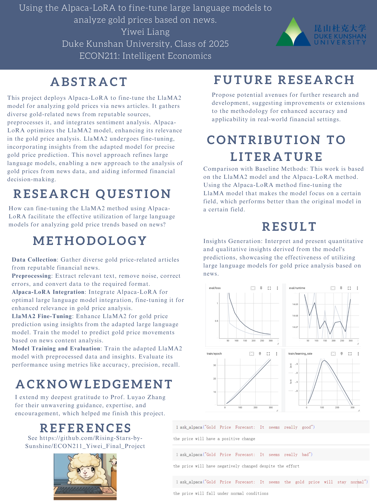

# Poster and Project Summary
## Background/Motivation
- This project deploys Alpaca-LoRA to fine-tune the LlaMA2 model for analyzing gold prices via news articles. It gathers diverse gold-related news from reputable sources, preprocesses it, and integrates sentiment analysis. Alpaca-LoRA optimizes the LlaMA2 model, enhancing its relevance in the gold price analysis. LlaMA2 undergoes fine-tuning, incorporating insights from the adapted model for precise gold price prediction. This novel approach refines large language models, enabling a new approach to the analysis of gold prices from news data, and aiding informed financial decision-making.
## Research Question
- How can fine-tuning the LlaMA2 method using Alpaca-LoRA facilitate the effective utilization of large language models for analyzing gold price trends based on news?
## Application Scenario (Data Source)
- Data Source: https://www.kaggle.com/datasets/ahsh37/forex-news-labeled
- In financial markets, the project wields Alpaca-LoRA to refine the LlaMA2 model. It sources varied gold-related news, performs robust preprocessing, and infuses sentiment analysis in a particular field. Alpaca-LoRA enhances LlaMA2's accuracy, enabling precise gold price forecasts. 
## Methodology
- Data Collection: Gather diverse gold price-related articles from reputable financial news.
- Preprocessing: Extract relevant text, remove noise, correct errors, and convert data to the required format.
- lpaca-LoRA Integration: Integrate Alpaca-LoRA for optimal large language model integration, fine-tuning it for enhanced relevance in gold price analysis.
- LlaMA2 Fine-Tuning: Enhance LlaMA2 for gold price prediction using insights from the adapted large language model. Train the model to predict gold price movements based on news content analysis.
M- odel Training and Evaluation: Train the adapted LlaMA2 model with preprocessed data and insights. Evaluate its performance using metrics like accuracy, precision, recall.
## Results
- Insights Generation: Interpret and present quantitative and qualitative insights derived from the model's predictions, showcasing the effectiveness of utilizing large language models for gold price analysis based on news.


## Intellectual Merits and Practical impacts 
- This project pioneers the application of Alpaca-LoRA to fine-tune the LlaMA2 model, revolutionizing gold price analysis via news articles. By integrating diverse gold-related news, robust preprocessing, and sentiment analysis, it establishes a cutting-edge approach. This advancement enhances LlaMA2's accuracy, offering precise gold price forecasts. Practically, it transforms financial decision-making by surpassing traditional methods. The refined analysis aids investors and analysts in navigating the volatile gold market. Using reputable data sources and rigorous preprocessing sets a new standard in financial analysis. The research demonstrates the effectiveness of large language models in predicting gold price trends from news data, fostering more accurate predictions and proactive investment strategies. Ultimately, it empowers stakeholders with a reliable tool for navigating the complexities of real-time gold price fluctuations, reshaping how financial analyses are conducted and decisions made.
## Poster
- 
## Citations
```
@article{aruna2021prediction,
  title={Prediction of potential gold prices using machine learning approach},
  author={Aruna, S and Umamaheswari, P and Sujipriya, J and others},
  journal={Annals of the Romanian Society for Cell Biology},
  pages={1385--1396},
  year={2021}
}
@article{hu2021lora,
  title={Lora: Low-rank adaptation of large language models},
  author={Hu, Edward J and Shen, Yelong and Wallis, Phillip and Allen-Zhu, Zeyuan and Li, Yuanzhi and Wang, Shean and Wang, Lu and Chen, Weizhu},
  journal={arXiv preprint arXiv:2106.09685},
  year={2021}
}
```