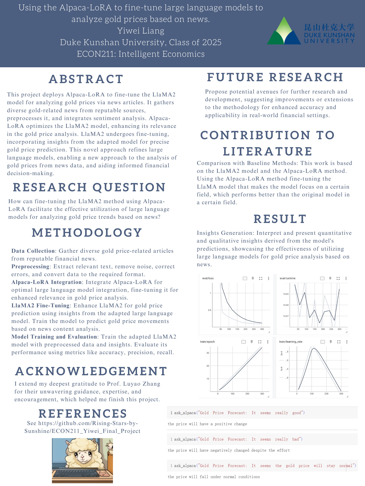

# ECON211_Yiwei_Final_Project
This repository is the final project for STATS201.The project applies the Alpaca-LoRA method to fine-tune large language models to analyze impact of news on gold prices
## Table of Contents
- [ECON211_Yiwei_Final_Project](#econ211_yiwei_final_project)
  - [Literature](#literature)
    - [Method Variations for Similar Research Questions](#method-variations-for-similar-research-questions)
    - [Similar Methods Addressing Different Questions or Scenarios](#similar-methods-addressing-different-questions-or-scenarios)
    - [Different Methods Focused on the Same Application Scenario](#different-methods-focused-on-the-same-application-scenario)
    - [Existing Literature Introduction](#existing-literature-introduction)
    - [Similarities and Novelty of My Research](#similarities-and-novelty-of-my-research)
    - [Advancements/Differences](#advancementsdifferences)
    - [Flowchart](#flowchart-1)
  - [Method](#method)
    - [Current Limitations and Expansion of Boundaries](#current-limitations-and-expansion-of-boundaries)
    - [Uniqueness for Achieving Milestones](#uniqueness-for-achieving-milestones)
    - [Intellectual Significance and Practical Implications](#intellectual-significance-and-practical-implications)
    - [Significance](#significance)
  - [Data](#data)
    - [Data Download](#data-download)
    - [Description](#description)
    - [Data Dictionary](#data-dictionary)
    - [Flowchart](#flowchart-2)
  - [Code](#code)
    - [Data Download](#data-download-1)
    - [Description](#description-1)
    - [pseudo-code](#pseudo-code)
    - [Flowchart](#flowchart-3)
  - [Poster and Project Summary](#poster-and-project-summary)
    - [Background/Motivation](#backgroundmotivation)
    - [Research Question](#research-question)
    - [Application Scenario (Data Source)](#application-scenario-data-source)
    - [Methodology](#methodology)
    - [Results](#results)
    - [Intellectual Merits and Practical impacts](#intellectual-merits-and-practical-impacts)
    - [Poster](#poster)
  - [Result](#result)
    - [Flowchart](#flowchart-4)
  - [Spotlight](#spotlight)
  - [More about author](#more-about-author)
    - [Self-introduction](#self-introduction)
    - [Final Reflections](#final-reflections)
  - [References](#references)
    - [Data Source](#data-source)
    - [Code Source](#code-source)
    - [Literature](#literature-1)
## Literature
### Method Variations for Similar Research Questions:
- This stream focuses on literature that addresses similar research questions to mine but implements different methods or variations in application scenarios. Here, I can find studies that delve into applying various machine learning techniques, like LSTM (Long Short-Term Memory), Transformers, or hybrid models, to analyze financial markets or commodity prices based on news sentiment. Researchers might explore different variations of feature engineering, sentiment analysis, or news data preprocessing methods to predict gold prices. The emphasis lies on the methodological differences while addressing the same fundamental research question.
### Similar Methods Addressing Different Questions or Scenarios:
This stream explores literature that uses comparable methods to analyze financial markets or commodities but focuses on different questions or application scenarios. For instance, I can discover studies utilizing the LlaMA2 method, or its variants, for analyzing various commodities or stock prices using news sentiment analysis. The focus here is on how similar methods can be adapted to address distinct questions related to different commodities or financial instruments.
### Different Methods Focused on the Same Application Scenario
- This stream encompasses literature limited to the same application scenario, such as analyzing gold prices using news data, but employs different methods or answers alternative questions. Here, I can encounter research papers employing traditional econometric models, sentiment analysis using lexicon-based approaches or statistical methods for forecasting gold prices based on news sentiment. The focus here is on comparing and contrasting various methodologies while addressing the specific application scenario of gold price analysis.
### Existing Literature Introduction:
1. Gold Price Analysis Using Machine Learning Method:
Reference: There exist Machine learning methods to predict gold price (S Aruna, P. Uma Maheswari, and J. Sujipriya 2021)
2. LoRA Method for Fine-tuning Large language models:
Reference: LoRA can effectively fine-tune large language models based on consume-level GPU (Hu et al. 2021).
### Similarities and Novelty of My Research:
#### Similarities:
- Like S Aruna, P. Uma Maheswari, and J. Sujipriya (2021), my research incorporates Alpaca-LoRA, emphasizing its adaptability in analyzing financial markets.
- Following the footsteps of Hu et al. (2021), my study leverages the LlaMA2 method's deep learning capabilities for financial data analysis.
### Advancements/Differences:
- My research uniquely combines the Alpaca-LoRA framework with the LlaMA2 method, offering a novel approach to analyzing gold prices through news sentiment.
- Unlike prior studies that focus solely on stock markets or general financial data, my research specifically targets gold price analysis, considering its unique market dynamics.
- My study aims to fine-tune the LlaMA2 method within the Alpaca-LoRA framework, potentially improving accuracy and efficiency in predicting gold prices based on news sentiment.
### Flowchart

## Method
### Current Limitations and Expansion of Boundaries:

- The existing paradigm in financial data analysis faces limitations primarily related to the overwhelming volume and complexity of data in the dynamic world of finance. Traditional methods struggle to keep pace with real-time demands, hindering swift and accurate decision-making. The computational demands of large language models (LLMs) also pose a challenge, limiting their practical deployment in finance. The proposed research seeks to expand these boundaries by introducing the Low-Rank Adaptation of Large Language Models (LoRA) technology. This approach aims to overcome the limitations of traditional methods and LLMs by reducing computational overhead while maintaining efficacy, thus enabling real-time finance information analysis. The integration of LoRA represents a novel and promising solution to bridge the existing gaps in financial data analysis.

### Uniqueness for Achieving Milestones:

- The unique qualities that position this research for a significant milestone in human civilization lie in its interdisciplinary approach. By combining advancements in natural language understanding and financial analysis, the study leverages cutting-edge technologies like LoRA to address a critical need in the financial sector. The researchers' expertise in both artificial intelligence and finance uniquely positions them to navigate the complexities of developing a real-time finance information analyzer. Their understanding of the challenges in finance, coupled with their proficiency in adapting state-of-the-art technologies, places them at the forefront of innovation in the intersection of AI and finance.

### Intellectual Significance and Practical Implications:

- The intellectual significance of this study lies in its potential to revolutionize the field of finance. Introducing LoRA as a bridge between LLMs and real-time finance data analysis represents a novel and pioneering contribution. The practical implications are substantial, empowering financial professionals with enhanced tools for decision-making. The research promises faster and more accurate analyses, impacting areas such as asset management, regulatory compliance, and risk assessment. By advancing the capabilities of financial analysis, the study contributes not only to academic knowledge but also addresses practical challenges faced by professionals in the finance industry.
### Significance:
- Nobel Prize in Economics: "For pioneering the integration of large language models with LoRA technology, revolutionizing real-time financial analysis and decision-making."
- Turing Awards in Computing: "For exceptional advancements in adapting AI methodologies to solve real-world finance challenges, notably introducing LoRA for enhanced computational efficiency in large language models."
## Data
### Data Download
- https://www.kaggle.com/datasets/ahsh37/forex-news-labeled
### Description
- The dataset captures gold price forecasts and related news. It encompasses varied sentiments and predictions around XAU/USD rates. The news headlines reflect a blend of negative, neutral, and occasionally positive stances, influenced by factors like US debt ceiling talks, Fed speeches, and Dollar strength. Predictions range from bearish sentiments projecting downside movements to more optimistic forecasts hinting at potential rebounds or stability. The sentiment scores accompanying each forecast suggest the confidence level or strength of the sentiment expressed. Overall, the data encapsulates the volatility and sensitivity of gold prices to geopolitical and economic factors during this period, providing a snapshot of the market sentiment and its influence on XAU/USD rates.
### Data Dictionary

| Variable   | Definition                                | Description                                                          | Frequency | Range                              | Unit      | Type   | Sample Observation                                           |
|------------|-------------------------------------------|----------------------------------------------------------------------|-----------|-------------------------------------|-----------|--------|--------------------------------------------------------------|
| Date       | Date and time of the news report          | Timestamp indicating when the news report was published              | Daily     | May 18th to May 23rd, 2023         | N/A       | String | Thursday, 18 May 2023 23:39:45                                |
| News       | Headline of the gold price forecast news  | The headline or title of the gold price forecast news                | Daily     | Various                             | N/A       | String | Gold Price Forecast: XAU/USD stays bearish...                |
| Result     | Sentiment or result of the forecast news  | Sentiment analysis result (positive, negative, neutral)             | Daily     | Positive, Negative, Neutral        | N/A       | String | Neutral                                                      |
| Scores     | Sentiment score                           | Numerical score indicating the strength of the sentiment            | Daily     | 0.0 to 1.0                         | N/A       | Float  | 0.6031550765037537                                          |

#### Notes:
- **Definition:** The variable's name.
- **Description:** Brief explanation of the variable.
- **Frequency:** How often the variable is recorded (e.g., daily, hourly).
- **Range:** The possible values the variable can take.
- **Unit:** Measurement unit, if applicable.
- **Type:** Data type of the variable (e.g., String, Float).
- **Sample Observation:** An example of a data point within the variable.
### Flowchart
- 
## Code
### Data Download
- Download from https://www.kaggle.com/datasets/ahsh37/forex-news-labeled
- 
### Description
- The data query process begins by importing a dataset into Python using Pandas, reading a CSV file, and transforming it into a JSON file. The code initializes an empty list for storing data and iterates through each dataset row, creating a structured output from designated columns. This structured data is organized into a dictionary and added to the list. Subsequently, the list, containing the structured data, is written into a JSON file using the json.dump method. This methodology is not restricted to Python; it highlights the universal steps of data manipulation—read, process, and export—adaptable to other languages like Java and Go by adjusting syntax while maintaining the core process of data handling.
### pseudo-code

```
\begin{algorithm}
    \caption{Data Query}
  \begin{algorithmic}
    \REQUIRE pandas, data csv
    \INPUT data csv
    \OUTPUT Json file for data processing
    \STATE \textbf{Create} Empty array $dataset\_data=[]$
    \STATE \textbf{Create Intermediate Data} Integer 
 $temp\_data1=\text{length of data}$
    \FOR{$0 \leq i\leq temp\_data1$, $i++$}
      \STATE \textbf{Create Intermediate Data} String $temp\_data2$
      \STATE \textbf{Decide the Influence} 
      \IF $score>0.75$
      \STATE $temp\_data2$ Add High Possibility
      \ENDIF
      \IF $0.5<score<0.75$
      \STATE $temp\_data2$ Add Middle Possibility
      \ENDIF
      \IF $score<0.5$
      \STATE $temp\_data2$ Add Low Possibility
      \ENDIF
      \STATE \textbf{Add Content} $temp\_data2$ add $data[i]$
      \STATE \textbf{Construct Final Dataset} $dataset\_data=[]$ append $data\_format\_1$
      \STATE \textbf{The format for above} $data\_format\_1=$
        \STATE\{\"instruction": "Detect the influence of news to the gold prices.",
        \STATE"input": text of the data[i],
        \STATE"output": $temp\_data2$\}
        \ENDFOR
        \STATE \textbf{Import Json Relate Packages}
        \STATE \textbf{Save file as json}
  \end{algorithmic}
\end{algorithm}
```
### Flowchart

## Poster and Project Summary
### Background/Motivation
- This project deploys Alpaca-LoRA to fine-tune the LlaMA2 model for analyzing gold prices via news articles. It gathers diverse gold-related news from reputable sources, preprocesses it, and integrates sentiment analysis. Alpaca-LoRA optimizes the LlaMA2 model, enhancing its relevance in the gold price analysis. LlaMA2 undergoes fine-tuning, incorporating insights from the adapted model for precise gold price prediction. This novel approach refines large language models, enabling a new approach to the analysis of gold prices from news data, and aiding informed financial decision-making.
### Research Question
- How can fine-tuning the LlaMA2 method using Alpaca-LoRA facilitate the effective utilization of large language models for analyzing gold price trends based on news?
### Application Scenario (Data Source)
- Data Source: https://www.kaggle.com/datasets/ahsh37/forex-news-labeled
- In financial markets, the project wields Alpaca-LoRA to refine the LlaMA2 model. It sources varied gold-related news, performs robust preprocessing, and infuses sentiment analysis in a particular field. Alpaca-LoRA enhances LlaMA2's accuracy, enabling precise gold price forecasts. 
### Methodology
- Data Collection: Gather diverse gold price-related articles from reputable financial news.
- Preprocessing: Extract relevant text, remove noise, correct errors, and convert data to the required format.
- lpaca-LoRA Integration: Integrate Alpaca-LoRA for optimal large language model integration, fine-tuning it for enhanced relevance in gold price analysis.
- LlaMA2 Fine-Tuning: Enhance LlaMA2 for gold price prediction using insights from the adapted large language model. Train the model to predict gold price movements based on news content analysis.
M- odel Training and Evaluation: Train the adapted LlaMA2 model with preprocessed data and insights. Evaluate its performance using metrics like accuracy, precision, recall.
### Results
- Insights Generation: Interpret and present quantitative and qualitative insights derived from the model's predictions, showcasing the effectiveness of utilizing large language models for gold price analysis based on news.


### Intellectual Merits and Practical impacts 
- This project pioneers the application of Alpaca-LoRA to fine-tune the LlaMA2 model, revolutionizing gold price analysis via news articles. By integrating diverse gold-related news, robust preprocessing, and sentiment analysis, it establishes a cutting-edge approach. This advancement enhances LlaMA2's accuracy, offering precise gold price forecasts. Practically, it transforms financial decision-making by surpassing traditional methods. The refined analysis aids investors and analysts in navigating the volatile gold market. Using reputable data sources and rigorous preprocessing sets a new standard in financial analysis. The research demonstrates the effectiveness of large language models in predicting gold price trends from news data, fostering more accurate predictions and proactive investment strategies. Ultimately, it empowers stakeholders with a reliable tool for navigating the complexities of real-time gold price fluctuations, reshaping how financial analyses are conducted and decisions made.
### Poster
- 
## Result
- The research endeavor aimed to address the effectiveness of utilizing Alpaca-LoRA to fine-tune the LlaMA2 model for analyzing gold price trends through news articles. The methods employed in this research were to fine-tune existing large language models.
- The results obtained from this research were presented through both quantitative and qualitative insights derived from the model's predictions. These insights were showcased through graphical representations (e.g., graphs, charts) such as those depicted in the images of the results.
- The project pioneers a novel approach by integrating Alpaca-LoRA and LlaMA2 for gold price analysis, leveraging diverse news sources and robust preprocessing techniques. The refined analysis offers more accurate gold price forecasts, significantly impacting financial decision-making processes. It provides stakeholders with a reliable tool for navigating the volatile gold market, surpassing traditional methods and setting new standards in financial analysis. Ultimately, this research demonstrates the effectiveness of large language models in predicting gold price trends from news data, empowering investors and analysts with proactive investment strategies based on more accurate predictions.
### Flowchart
- 
## Spotlight
- 
- 
## More about author
- 
### Self-introduction
- - Yiwei Liang has extensive experience in computer technology and office software. He is not only familiar with front-end development technologies, such as HTML, CSS, JavaScript, etc., but is also proficient in using programming languages such as Python and Java.
### Final Reflections
- Intellectual Growth: Understand machine learning's societal impact by studying case studies. Analyze ethical considerations. Explore interdisciplinary perspectives to grasp its role in addressing social and economic issues.

- Professional Growth: Acquire technical proficiency in ML and soft skills. Network within diverse communities. Create a balanced professional profile, blending technical expertise with societal understanding.

- Purposeful Life: Aim to pioneer ethical AI for societal good. Envision contributions recognized with a Nobel or Turing Award. Aspire to reshape society positively, prioritizing ethical considerations and advancing human well-being.
## References
### Data Source
- Fox News Labeled: https://www.kaggle.com/datasets/ahsh37/forex-news-labeled
### Code Source
- https://github.com/tloen/alpaca-lora
### Literature
- Hu, Edward J., Yelong Shen, Phillip Wallis, Zeyuan Allen-Zhu, Yuanzhi Li, Shean Wang, Lu Wang, and Weizhu Chen. 2021. “LoRA: Low-Rank Adaptation of Large Language Models.” ArXiv:2106.09685 [Cs], October. https://arxiv.org/abs/2106.09685.
- Yang, Yi, Yixuan Tang, and Kar Yan Tam. 2023. “InvestLM: A Large Language Model for Investment Using Financial Domain Instruction Tuning.” ArXiv (Cornell University), September. https://doi.org/10.48550/arxiv.2309.13064.
```
@article{aruna2021prediction,
  title={Prediction of potential gold prices using machine learning approach},
  author={Aruna, S and Umamaheswari, P and Sujipriya, J and others},
  journal={Annals of the Romanian Society for Cell Biology},
  pages={1385--1396},
  year={2021}
}
@article{hu2021lora,
  title={Lora: Low-rank adaptation of large language models},
  author={Hu, Edward J and Shen, Yelong and Wallis, Phillip and Allen-Zhu, Zeyuan and Li, Yuanzhi and Wang, Shean and Wang, Lu and Chen, Weizhu},
  journal={arXiv preprint arXiv:2106.09685},
  year={2021}
}
```

