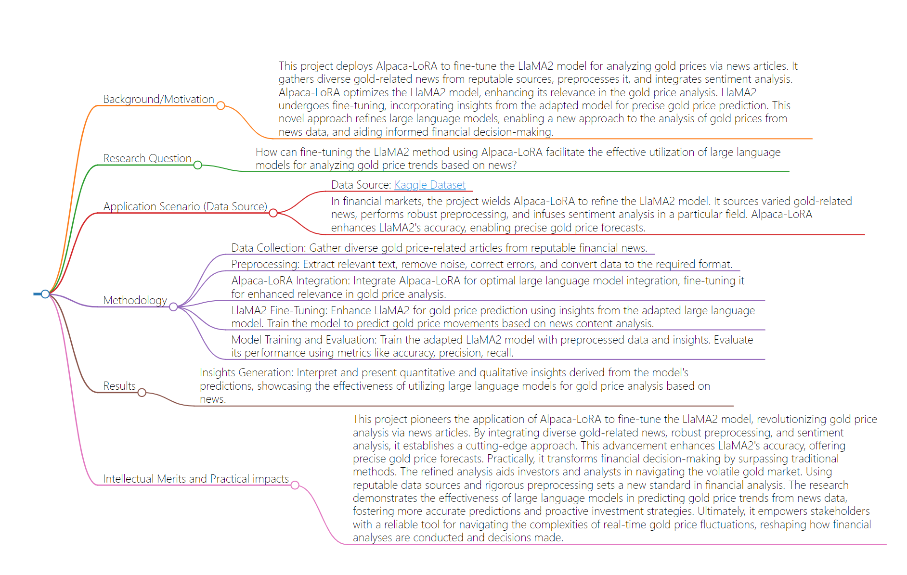

# Result
- The research endeavor aimed to address the effectiveness of utilizing Alpaca-LoRA to fine-tune the LlaMA2 model for analyzing gold price trends through news articles. The methods employed in this research were to fine-tune existing large language models.
- The results obtained from this research were presented through both quantitative and qualitative insights derived from the model's predictions. These insights were showcased through graphical representations (e.g., graphs, charts) such as those depicted in the images of the results.
- The project pioneers a novel approach by integrating Alpaca-LoRA and LlaMA2 for gold price analysis, leveraging diverse news sources and robust preprocessing techniques. The refined analysis offers more accurate gold price forecasts, significantly impacting financial decision-making processes. It provides stakeholders with a reliable tool for navigating the volatile gold market, surpassing traditional methods and setting new standards in financial analysis. Ultimately, this research demonstrates the effectiveness of large language models in predicting gold price trends from news data, empowering investors and analysts with proactive investment strategies based on more accurate predictions.
## Flowchart
- 